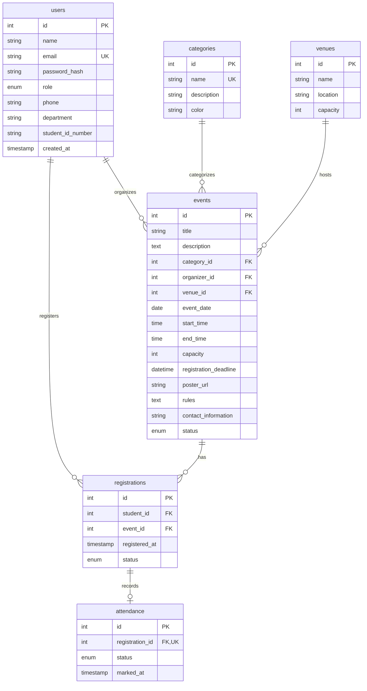

# 🎓 Campus Event Management System (CampusEventHub)

> A modern, production-grade, full-stack college event discovery, ticketing, and attendance management platform built with **React (Vite + Tailwind CSS)**, **Node.js (Express.js REST APIs)**, and **Cloud MySQL**.

[](https://campus-event-system-pi.vercel.app/)
[](https://campus-event-system-9di7.onrender.com/)
[](https://aiven.io/)
[](https://github.com/Aarjoo003/Campus_Event_system)

---

## 🌐 Live Production Links

| Resource | Live Link | Status | Description |
| :--- | :--- | :---: | :--- |
| **Frontend Web App** | [https://campus-event-system-pi.vercel.app/](https://campus-event-system-pi.vercel.app/) |  | Hosted on **Vercel** with global CDN and automated CI/CD deployment. |
| **Backend REST API** | [https://campus-event-system-9di7.onrender.com/](https://campus-event-system-9di7.onrender.com/) |  | Hosted on **Render** (Node.js/Express) with SSL & health monitoring. |
| **API Health Check** | [https://campus-event-system-9di7.onrender.com/api/health](https://campus-event-system-9di7.onrender.com/api/health) |  | Real-time service uptime, version `1.0.1`, and status check. |
| **Cloud Database** | Cloud MySQL Cluster |  | Managed MySQL 8.0/9.x cluster with SSL encryption and automated backups. |

---

## 1. Project Overview

**CampusEventHub** is a centralized web platform designed for colleges and universities. It replaces paper notices and fragmented chat groups by providing:
- **Students** with a discovery portal to browse, search, and register for campus hackathons, cultural festivals, sports tournaments, and workshops with real-time seat availability and instant confirmations.
- **Student Clubs & Event Organizers** with self-service tools to publish events, enforce venue and capacity limits, track registrations, and record live student attendance (Present/Absent).
- **University Administrators** with global supervision, user management, event moderation (Approve / Reject), and platform analytics.

---

## 2. Key Features by Role

### 👨‍🎓 Student
- **Authentication**: Secure JWT registration, login, profile management, and password updates.
- **Event Discovery**: Search by keyword; filter by Category (Technical, Cultural, Sports, etc.), Venue, Date, and "Upcoming Only".
- **Real-Time Seat Availability**: Live capacity counter; prevents overbooking via atomic MySQL database transactions.
- **One-Click Registration**: Secure confirmation, duplicate registration prevention (`UNIQUE(student_id, event_id)`).
- **My Events Portal**: Track upcoming bookings, past events, registration statuses, and verified attendance marks.
- **Self-Service Cancellation**: Free up seats for fellow students if plans change before the event deadline.

### 🏛️ Club / Event Organizer
- **Organizer Dashboard**: Visual summary of hosted events, total registrations received, and verified attendance count.
- **Event Management (CRUD)**: Create, edit, and delete events with date, time, venue, rules, and contact info.
- **Capacity & Venue Checks**: Validates event capacity against the physical seating capacity of university venues.
- **Attendee Roster**: Searchable student attendee list with emails, departments, roll numbers, and registration timestamps.
- **Live Attendance Marking**: On-the-spot check-in controls to mark students **PRESENT** or **ABSENT** with timestamp logging.

### 🛡️ University Administrator
- **Admin Dashboard**: Real-time KPI metrics (Total Students, Organizers, Events, Registrations, Attendance).
- **User Directory**: Search and filter all registered users; promote or demote roles (Student ⇄ Organizer ⇄ Admin); remove invalid accounts.
- **Event Moderation**: Review pending events; approve or reject submissions; delete inappropriate events across campus.

---

## 3. Technology Stack

| Layer | Technologies | Rationale / Highlights |
| :--- | :--- | :--- |
| **Frontend** | React 18, Vite, JavaScript, Tailwind CSS, Lucide React, React Router 6 | High-speed HMR, clean component architecture, responsive utility styling, accessible SVG icons. |
| **Backend** | Node.js, Express.js, RESTful APIs, JWT (`jsonwebtoken`), `bcryptjs` | Lightweight non-blocking I/O, modular router/controller architecture, secure password hashing. |
| **Database** | MySQL (8.0+ / 9.x compatible), `mysql2/promise` connection pool | Relational normalization, Foreign Key constraints, ACID transactions (`SELECT ... FOR UPDATE`), indexes. |
| **API Client** | Axios with request & response interceptors | Automatic Bearer token injection, centralized 401 session expiry handling. |
| **Testing** | Postman Collection (v2.1.0) | Complete collection covering all endpoints with dynamic variable chaining. |

---

## 4. System Architecture

```text
       ┌────────────────────────────────────────────────────────┐
       │                Client Browser / Mobile                 │
       │       (React 18 + Vite + Tailwind CSS + Axios)         │
       └──────────────────────────┬─────────────────────────────┘
                                  │ HTTP / REST APIs
                                  │ (JSON + Bearer JWT)
                                  ▼
       ┌────────────────────────────────────────────────────────┐
       │             Node.js + Express.js Backend               │
       │                                                        │
       │  ┌──────────────────┐          ┌───────────────────┐   │
       │  │  authMiddleware  │          │  roleMiddleware   │   │
       │  └────────┬─────────┘          └─────────┬─────────┘   │
       │           ▼                              ▼             │
       │  ┌──────────────────┐          ┌───────────────────┐   │
       │  │   Controllers    │ ◄──────► │      Models       │   │
       │  └──────────────────┘          └─────────┬─────────┘   │
       └──────────────────────────────────────────┼─────────────┘
                                                  │ mysql2/promise
                                                  │ Connection Pool
                                                  ▼
       ┌────────────────────────────────────────────────────────┐
       │                    MySQL Database                      │
       │   (users, categories, venues, events, registrations)   │
       └────────────────────────────────────────────────────────┘
```

---

## 5. Database Schema & Normalization

The database schema (`backend/database/schema.sql`) adheres to **3rd Normal Form (3NF)**:



### Key Relational Safeguards:
1. **Duplicate Prevention**: `UNIQUE KEY unique_student_event (student_id, event_id)` prevents double bookings at the database engine level.
2. **Atomic Registration Transaction**: Uses `conn.beginTransaction()` and row-level locking to verify remaining capacity before inserting a new booking.
3. **Dynamic Available Seats**: Calculated dynamically via `GREATEST(e.capacity - COUNT(CASE WHEN r.status = 'CONFIRMED' THEN 1 END), 0)` to eliminate desync bugs.
4. **Referential Integrity**: Cascading updates and restricts (`ON DELETE RESTRICT` on categories/venues; `ON DELETE CASCADE` on bookings and attendance).

---

## 6. Folder Structure

```text
Campus_Event_system/
├── backend/
│   ├── database/
│   │   ├── schema.sql              # Clean DDL definitions & constraints
│   │   ├── seed.sql                # Realistic university demo data
│   │   └── initDb.js               # One-click Node.js database setup script
│   ├── src/
│   │   ├── config/
│   │   │   └── db.js               # mysql2 connection pool
│   │   ├── controllers/            # Request handlers
│   │   │   ├── adminController.js
│   │   │   ├── attendanceController.js
│   │   │   ├── authController.js
│   │   │   ├── eventController.js
│   │   │   └── registrationController.js
│   │   ├── middleware/             # Express middleware
│   │   │   ├── authMiddleware.js   # JWT verification
│   │   │   ├── errorMiddleware.js  # Centralized error handler
│   │   │   ├── roleMiddleware.js   # RBAC permission checks
│   │   │   └── validationMiddleware.js
│   │   ├── models/                 # Pure SQL query layers
│   │   │   ├── attendanceModel.js
│   │   │   ├── eventModel.js
│   │   │   ├── lookupModel.js
│   │   │   ├── registrationModel.js
│   │   │   └── userModel.js
│   │   ├── routes/                 # REST endpoints routing
│   │   │   ├── adminRoutes.js
│   │   │   ├── authRoutes.js
│   │   │   ├── eventRoutes.js
│   │   │   └── registrationRoutes.js
│   │   ├── utils/
│   │   │   └── responseHandler.js  # Standard JSON responses
│   │   └── server.js               # Express application entry point
│   ├── .env.example
│   ├── .env
│   └── package.json
│
├── frontend/
│   ├── src/
│   │   ├── components/             # Reusable UI widgets
│   │   │   ├── Badge.jsx
│   │   │   ├── EmptyState.jsx
│   │   │   ├── EventCard.jsx
│   │   │   ├── Footer.jsx
│   │   │   ├── LoadingSpinner.jsx
│   │   │   ├── Modal.jsx
│   │   │   ├── Navbar.jsx
│   │   │   └── ProtectedRoute.jsx
│   │   ├── context/
│   │   │   └── AuthContext.jsx     # Global auth state & tokens
│   │   ├── layouts/
│   │   │   └── MainLayout.jsx
│   │   ├── pages/
│   │   │   ├── admin/              # Admin control views
│   │   │   │   ├── AdminDashboard.jsx
│   │   │   │   ├── AdminEvents.jsx
│   │   │   │   └── AdminUsers.jsx
│   │   │   ├── organizer/          # Club organizer views
│   │   │   │   ├── CreateEvent.jsx
│   │   │   │   ├── EditEvent.jsx
│   │   │   │   ├── EventRegistrations.jsx
│   │   │   │   ├── ManageEvents.jsx
│   │   │   │   └── OrganizerDashboard.jsx
│   │   │   ├── student/            # Student portal views
│   │   │   │   ├── MyEvents.jsx
│   │   │   │   ├── ProfilePage.jsx
│   │   │   │   └── StudentDashboard.jsx
│   │   │   ├── EventDetailsPage.jsx
│   │   │   ├── EventDiscoveryPage.jsx
│   │   │   ├── LandingPage.jsx
│   │   │   ├── LoginPage.jsx
│   │   │   └── RegisterPage.jsx
│   │   ├── services/               # Modular Axios API calls
│   │   │   ├── adminService.js
│   │   │   ├── api.js
│   │   │   ├── authService.js
│   │   │   ├── eventService.js
│   │   │   └── registrationService.js
│   │   ├── App.jsx                 # Route declarations
│   │   ├── index.css               # Tailwind directives
│   │   └── main.jsx
│   ├── index.html
│   ├── package.json
│   ├── postcss.config.js
│   ├── tailwind.config.js
│   └── vite.config.js
│
├── postman/
│   └── Campus_Event_System.postman_collection.json
├── .gitignore
└── README.md
```

---

## 7. REST API Endpoints Reference

### Authentication (`/api/auth`)
| Method | Endpoint | Access | Description |
| :--- | :--- | :--- | :--- |
| `POST` | `/api/auth/register` | Public | Create new Student or Organizer account |
| `POST` | `/api/auth/login` | Public | Authenticate user and return JWT |
| `GET` | `/api/auth/me` | Authenticated | Fetch current profile |
| `PUT` | `/api/auth/profile` | Authenticated | Update name, department, phone, roll # |
| `PUT` | `/api/auth/change-password` | Authenticated | Verify old password and set new password |

### Events (`/api/events`)
| Method | Endpoint | Access | Description |
| :--- | :--- | :--- | :--- |
| `GET` | `/api/events` | Public / Opt-Auth | List events with filters (search, category, date, venue) |
| `GET` | `/api/events/metadata` | Public | Return categories and venues for dropdowns |
| `GET` | `/api/events/:id` | Public / Opt-Auth | Get complete event details, available seats, status |
| `POST` | `/api/events` | Organizer, Admin | Create a new campus event |
| `PUT` | `/api/events/:id` | Organizer (Own), Admin | Update event details |
| `DELETE` | `/api/events/:id` | Organizer (Own), Admin | Delete event and cascade cancellations |
| `GET` | `/api/events/organizer/my-events`| Organizer, Admin | List events hosted by logged-in organizer |
| `POST` | `/api/events/:id/register` | Student, Admin | Register / book seat for event |
| `DELETE` | `/api/events/:id/register` | Student, Admin | Cancel event booking |
| `GET` | `/api/events/:id/registrations` | Organizer, Admin | List attendees and attendance status |

### Registrations & Attendance (`/api/registrations`, `/api/my-events`)
| Method | Endpoint | Access | Description |
| :--- | :--- | :--- | :--- |
| `GET` | `/api/my-events` | Student, Admin | List student's registrations and attendance |
| `PUT` | `/api/registrations/:id/attendance`| Organizer, Admin | Mark student `PRESENT` or `ABSENT` |

### Administration (`/api/admin`)
| Method | Endpoint | Access | Description |
| :--- | :--- | :--- | :--- |
| `GET` | `/api/admin/dashboard` | Admin | Overall metrics, recent registrations, upcoming events |
| `GET` | `/api/admin/users` | Admin | Get user directory with role and search filters |
| `PUT` | `/api/admin/users/:id/role` | Admin | Update user role (STUDENT, ORGANIZER, ADMIN) |
| `DELETE` | `/api/admin/users/:id` | Admin | Permanently delete user |
| `PUT` | `/api/admin/events/:id/status`| Admin | Moderate event status (APPROVED, PENDING, REJECTED) |
| `GET` | `/api/admin/student/dashboard`| Student, Admin | Get student KPI stats |
| `GET` | `/api/admin/organizer/dashboard`| Organizer, Admin | Get organizer KPI stats |

---

## 8. Role-Based Access Control (RBAC) Matrix

| Permission / Action | Student | Organizer | Admin |
| :--- | :---: | :---: | :---: |
| Browse & Search Events | ✅ | ✅ | ✅ |
| View Event Details & Seats | ✅ | ✅ | ✅ |
| Register for Events | ✅ | ❌ | ✅ |
| Cancel Own Registration | ✅ | ❌ | ✅ |
| View My Events & Attendance | ✅ | ❌ | ✅ |
| Create Events | ❌ | ✅ | ✅ |
| Edit & Delete Own Events | ❌ | ✅ | ✅ |
| View Attendees for Own Events | ❌ | ✅ | ✅ |
| Mark Student Attendance | ❌ | ✅ | ✅ |
| Moderate Any Campus Event | ❌ | ❌ | ✅ |
| Manage User Directory & Roles | ❌ | ❌ | ✅ |
| Access Global Admin KPIs | ❌ | ❌ | ✅ |

---

## 9. Demo Login Credentials

All demo accounts are seeded with password: **`password123`**

| Role | Name | Email Address | Password |
| :--- | :--- | :--- | :--- |
| **Admin** | System Administrator | `admin@campus.edu` | `password123` |
| **Organizer** | Tech Innovation Club | `tech.club@campus.edu` | `password123` |
| **Organizer** | Cultural Affairs Council | `cultural.sec@campus.edu` | `password123` |
| **Organizer** | Campus Sports Committee | `sports.officer@campus.edu` | `password123` |
| **Student** | Alex Johnson | `student1@campus.edu` | `password123` |
| **Student** | Priya Sharma | `student2@campus.edu` | `password123` |
| **Student** | David Miller | `student3@campus.edu` | `password123` |
| **Student** | Sara Williams | `student4@campus.edu` | `password123` |

> 💡 **Quick Login Tip**: The Login page includes convenient **1-Click Quick Demo Buttons** for Student, Organizer, and Admin to pre-fill credentials instantly!

---

## 10. Production Deployment & Cloud Architecture

The system is deployed using modern cloud infrastructure:

```
┌─────────────────────────────────┐        ┌─────────────────────────────────┐
│         Vercel (Frontend)       │        │         Render (Backend)        │
│   campus-event-system-pi.vercel.app  │ ◄────► │ campus-event-system-9di7.onrender.com │
└─────────────────────────────────┘        └────────────────┬────────────────┘
                                                            │ SSL / TLS (Port 3306)
                                                            ▼
                                           ┌─────────────────────────────────┐
                                           │       Aiven Cloud MySQL         │
                                           │        (defaultdb Cluster)      │
                                           └─────────────────────────────────┘
```

### 🌍 Cloud Hosting Summary:
1. **Frontend (Vercel)**:
   - Built with Vite & React, hosted on Vercel's Edge Network for sub-second global page loads.
   - SPA client-side routing handled via `vercel.json` rewrite rules.
   - Automatic API proxying and fallback to the live Render backend API.
2. **Backend REST API (Render)**:
   - Node.js Express server running with connection pooling, CORS credentials, and helmet security headers.
   - Dual-mount routing (`/api/*` and direct route aliases) ensures zero breaking changes across clients.
   - Live health checks at `/api/health` reporting uptime and version `1.0.1`.
3. **Database (Aiven Cloud MySQL)**:
   - High-availability managed MySQL 8.0/9.x database cluster.
   - End-to-end TLS/SSL encrypted connection pool using `mysql2/promise`.
   - Seeded with 12 real-world campus events across 6 distinct categories and campus venues.

---

## 11. Environment Configuration & Setup Guide

### ⚙️ Environment Variables Template (`backend/.env.example`)
To configure the application for deployment or local execution, create a `.env` file in the `backend/` directory based on the template:

```env
# Application Server Port
PORT=5001
NODE_ENV=production

# Database Connection (Cloud MySQL or Local Instance)
DB_HOST=your_mysql_host
DB_PORT=3306
DB_USER=your_mysql_username
DB_PASSWORD=your_mysql_password
DB_NAME=your_database_name
DB_SSL=true

# JWT Authentication
JWT_SECRET=your_secure_jwt_secret_key
JWT_EXPIRES_IN=7d

# Allowed Frontend Origin (for CORS)
FRONTEND_URL=https://campus-event-system-pi.vercel.app
```

---

### 🗄️ Database Initialization
To initialize the database schema and populate seed data:

```powershell
cd backend
npm run db:init
```

The script will automatically:
1. Establish a secure connection with the configured MySQL instance.
2. Execute `backend/database/schema.sql` to build 3NF relational tables and constraints.
3. Execute `backend/database/seed.sql` to populate categories, venues, accounts, and demo events.

---

### 🚀 Running the Services

#### 1. Backend Service
```powershell
cd backend
npm start
```
*The Express server initializes the database pool and starts listening on the designated `PORT`.*  
Verify the service status by accessing `/api/health`.

#### 2. Frontend Application
```powershell
cd frontend
npm run dev
```
*Vite compiles and serves the application with instant Hot Module Replacement (HMR).*  
Access the web application in your browser to experience the live platform!

---

## 12. Postman Collection Testing

A pre-configured Postman collection is included at:  
📂 `postman/Campus_Event_System.postman_collection.json`

* **Default Base URL:** `https://campus-event-system-9di7.onrender.com` (configured to test against the live cloud backend out of the box).

### How to test:
1. Open **Postman**.
2. Click **Import** and select `postman/Campus_Event_System.postman_collection.json`.
3. The collection is organized into 4 modular folders:
   - **Authentication**: Register, Student Login, Organizer Login, Admin Login, Get Current User, Update Profile.
   - **Events**: Filter/Search Events, Get Metadata, View Event Details, Create Event, Update Event, Delete Event.
   - **Registrations & Attendance**: Register for Event, Cancel Registration, My Events, Get Event Registrations, Mark Attendance.
   - **Admin Operations**: System Dashboard, Manage Users, Update User Role, Moderate Event Status.
4. When you execute any login request (**Student Login**, **Organizer Login**, or **Admin Login**), the test script **automatically captures the JWT token** and stores it in the collection variable `token` for subsequent authenticated calls.

---
