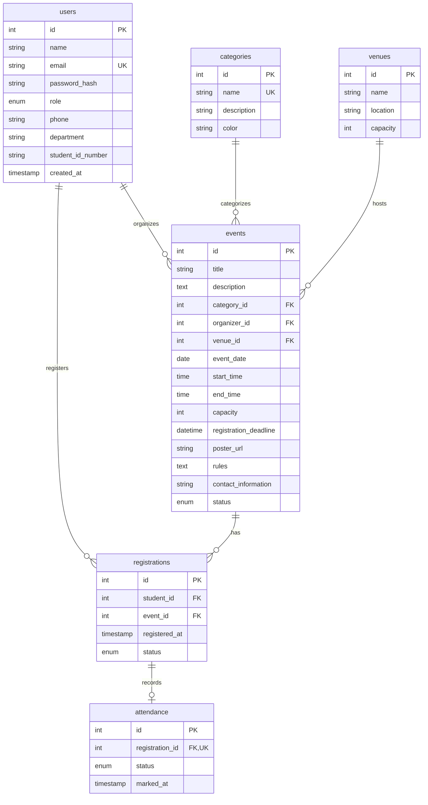

# Campus Event Management System (CampusEventHub)

> A modern, production-style, full-stack college event discovery, ticketing, and attendance management platform built from scratch with **React (Vite + Tailwind CSS)**, **Node.js (Express.js REST APIs)**, and **MySQL**.

---

## 1. Project Overview

**CampusEventHub** is a centralized web platform designed for colleges and universities. It replaces paper notices and fragmented chat groups by providing:
- **Students** with a discovery portal to browse, search, and register for campus hackathons, cultural festivals, sports tournaments, and workshops with real-time seat availability and instant confirmations.
- **Student Clubs & Event Organizers** with self-service tools to publish events, enforce venue and capacity limits, track registrations, and record live student attendance (Present/Absent).
- **University Administrators** with global supervision, user management, event moderation (Approve / Reject), and platform analytics.

---

## 2. Key Features by Role

### 👨‍🎓 Student
- **Authentication**: Secure JWT registration, login, profile management, and password updates.
- **Event Discovery**: Search by keyword; filter by Category (Technical, Cultural, Sports, etc.), Venue, Date, and "Upcoming Only".
- **Real-Time Seat Availability**: Live capacity counter; prevents overbooking via atomic MySQL database transactions.
- **One-Click Registration**: Secure confirmation, duplicate registration prevention (`UNIQUE(student_id, event_id)`).
- **My Events Portal**: Track upcoming bookings, past events, registration statuses, and verified attendance marks.
- **Self-Service Cancellation**: Free up seats for fellow students if plans change before the event deadline.

### 🏛️ Club / Event Organizer
- **Organizer Dashboard**: Visual summary of hosted events, total registrations received, and verified attendance count.
- **Event Management (CRUD)**: Create, edit, and delete events with date, time, venue, rules, and contact info.
- **Capacity & Venue Checks**: Validates event capacity against the physical seating capacity of university venues.
- **Attendee Roster**: Searchable student attendee list with emails, departments, roll numbers, and registration timestamps.
- **Live Attendance Marking**: On-the-spot check-in controls to mark students **PRESENT** or **ABSENT** with timestamp logging.

### 🛡️ University Administrator
- **Admin Dashboard**: Real-time KPI metrics (Total Students, Organizers, Events, Registrations, Attendance).
- **User Directory**: Search and filter all registered users; promote or demote roles (Student ⇄ Organizer ⇄ Admin); remove invalid accounts.
- **Event Moderation**: Review pending events; approve or reject submissions; delete inappropriate events across campus.

---

## 3. Technology Stack

| Layer | Technologies | Rationale / Highlights |
| :--- | :--- | :--- |
| **Frontend** | React 18, Vite, JavaScript, Tailwind CSS, Lucide React, React Router 6 | High-speed HMR, clean component architecture, responsive utility styling, accessible SVG icons. |
| **Backend** | Node.js, Express.js, RESTful APIs, JWT (`jsonwebtoken`), `bcryptjs` | Lightweight non-blocking I/O, modular router/controller architecture, secure password hashing. |
| **Database** | MySQL (8.0+ / 9.x compatible), `mysql2/promise` connection pool | Relational normalization, Foreign Key constraints, ACID transactions (`SELECT ... FOR UPDATE`), indexes. |
| **API Client** | Axios with request & response interceptors | Automatic Bearer token injection, centralized 401 session expiry handling. |
| **Testing** | Postman Collection (v2.1.0) | Complete collection covering all endpoints with dynamic variable chaining. |

---

## 4. System Architecture

```text
       ┌────────────────────────────────────────────────────────┐
       │                Client Browser / Mobile                 │
       │       (React 18 + Vite + Tailwind CSS + Axios)         │
       └──────────────────────────┬─────────────────────────────┘
                                  │ HTTP / REST APIs
                                  │ (JSON + Bearer JWT)
                                  ▼
       ┌────────────────────────────────────────────────────────┐
       │             Node.js + Express.js Backend               │
       │                                                        │
       │  ┌──────────────────┐          ┌───────────────────┐   │
       │  │  authMiddleware  │          │  roleMiddleware   │   │
       │  └────────┬─────────┘          └─────────┬─────────┘   │
       │           ▼                              ▼             │
       │  ┌──────────────────┐          ┌───────────────────┐   │
       │  │   Controllers    │ ◄──────► │      Models       │   │
       │  └──────────────────┘          └─────────┬─────────┘   │
       └──────────────────────────────────────────┼─────────────┘
                                                  │ mysql2/promise
                                                  │ Connection Pool
                                                  ▼
       ┌────────────────────────────────────────────────────────┐
       │                    MySQL Database                      │
       │   (users, categories, venues, events, registrations)   │
       └────────────────────────────────────────────────────────┘
```

---

## 5. Database Schema & Normalization

The database schema (`backend/database/schema.sql`) adheres to **3rd Normal Form (3NF)**:



### Key Relational Safeguards:
1. **Duplicate Prevention**: `UNIQUE KEY unique_student_event (student_id, event_id)` prevents double bookings at the database engine level.
2. **Atomic Registration Transaction**: Uses `conn.beginTransaction()` and row-level locking to verify remaining capacity before inserting a new booking.
3. **Dynamic Available Seats**: Calculated dynamically via `GREATEST(e.capacity - COUNT(CASE WHEN r.status = 'CONFIRMED' THEN 1 END), 0)` to eliminate desync bugs.
4. **Referential Integrity**: Cascading updates and restricts (`ON DELETE RESTRICT` on categories/venues; `ON DELETE CASCADE` on bookings and attendance).

---

## 6. Folder Structure

```text
Campus_Event_system/
├── backend/
│   ├── database/
│   │   ├── schema.sql              # Clean DDL definitions & constraints
│   │   ├── seed.sql                # Realistic university demo data
│   │   └── initDb.js               # One-click Node.js database setup script
│   ├── src/
│   │   ├── config/
│   │   │   └── db.js               # mysql2 connection pool
│   │   ├── controllers/            # Request handlers
│   │   │   ├── adminController.js
│   │   │   ├── attendanceController.js
│   │   │   ├── authController.js
│   │   │   ├── eventController.js
│   │   │   └── registrationController.js
│   │   ├── middleware/             # Express middleware
│   │   │   ├── authMiddleware.js   # JWT verification
│   │   │   ├── errorMiddleware.js  # Centralized error handler
│   │   │   ├── roleMiddleware.js   # RBAC permission checks
│   │   │   └── validationMiddleware.js
│   │   ├── models/                 # Pure SQL query layers
│   │   │   ├── attendanceModel.js
│   │   │   ├── eventModel.js
│   │   │   ├── lookupModel.js
│   │   │   ├── registrationModel.js
│   │   │   └── userModel.js
│   │   ├── routes/                 # REST endpoints routing
│   │   │   ├── adminRoutes.js
│   │   │   ├── authRoutes.js
│   │   │   ├── eventRoutes.js
│   │   │   └── registrationRoutes.js
│   │   ├── utils/
│   │   │   └── responseHandler.js  # Standard JSON responses
│   │   └── server.js               # Express application entry point
│   ├── .env.example
│   ├── .env
│   └── package.json
│
├── frontend/
│   ├── src/
│   │   ├── components/             # Reusable UI widgets
│   │   │   ├── Badge.jsx
│   │   │   ├── EmptyState.jsx
│   │   │   ├── EventCard.jsx
│   │   │   ├── Footer.jsx
│   │   │   ├── LoadingSpinner.jsx
│   │   │   ├── Modal.jsx
│   │   │   ├── Navbar.jsx
│   │   │   └── ProtectedRoute.jsx
│   │   ├── context/
│   │   │   └── AuthContext.jsx     # Global auth state & tokens
│   │   ├── layouts/
│   │   │   └── MainLayout.jsx
│   │   ├── pages/
│   │   │   ├── admin/              # Admin control views
│   │   │   │   ├── AdminDashboard.jsx
│   │   │   │   ├── AdminEvents.jsx
│   │   │   │   └── AdminUsers.jsx
│   │   │   ├── organizer/          # Club organizer views
│   │   │   │   ├── CreateEvent.jsx
│   │   │   │   ├── EditEvent.jsx
│   │   │   │   ├── EventRegistrations.jsx
│   │   │   │   ├── ManageEvents.jsx
│   │   │   │   └── OrganizerDashboard.jsx
│   │   │   ├── student/            # Student portal views
│   │   │   │   ├── MyEvents.jsx
│   │   │   │   ├── ProfilePage.jsx
│   │   │   │   └── StudentDashboard.jsx
│   │   │   ├── EventDetailsPage.jsx
│   │   │   ├── EventDiscoveryPage.jsx
│   │   │   ├── LandingPage.jsx
│   │   │   ├── LoginPage.jsx
│   │   │   └── RegisterPage.jsx
│   │   ├── services/               # Modular Axios API calls
│   │   │   ├── adminService.js
│   │   │   ├── api.js
│   │   │   ├── authService.js
│   │   │   ├── eventService.js
│   │   │   └── registrationService.js
│   │   ├── App.jsx                 # Route declarations
│   │   ├── index.css               # Tailwind directives
│   │   └── main.jsx
│   ├── index.html
│   ├── package.json
│   ├── postcss.config.js
│   ├── tailwind.config.js
│   └── vite.config.js
│
├── postman/
│   └── Campus_Event_System.postman_collection.json
├── .gitignore
└── README.md
```

---

## 7. REST API Endpoints Reference

### Authentication (`/api/auth`)
| Method | Endpoint | Access | Description |
| :--- | :--- | :--- | :--- |
| `POST` | `/api/auth/register` | Public | Create new Student or Organizer account |
| `POST` | `/api/auth/login` | Public | Authenticate user and return JWT |
| `GET` | `/api/auth/me` | Authenticated | Fetch current profile |
| `PUT` | `/api/auth/profile` | Authenticated | Update name, department, phone, roll # |
| `PUT` | `/api/auth/change-password` | Authenticated | Verify old password and set new password |

### Events (`/api/events`)
| Method | Endpoint | Access | Description |
| :--- | :--- | :--- | :--- |
| `GET` | `/api/events` | Public / Opt-Auth | List events with filters (search, category, date, venue) |
| `GET` | `/api/events/metadata` | Public | Return categories and venues for dropdowns |
| `GET` | `/api/events/:id` | Public / Opt-Auth | Get complete event details, available seats, status |
| `POST` | `/api/events` | Organizer, Admin | Create a new campus event |
| `PUT` | `/api/events/:id` | Organizer (Own), Admin | Update event details |
| `DELETE` | `/api/events/:id` | Organizer (Own), Admin | Delete event and cascade cancellations |
| `GET` | `/api/events/organizer/my-events`| Organizer, Admin | List events hosted by logged-in organizer |
| `POST` | `/api/events/:id/register` | Student, Admin | Register / book seat for event |
| `DELETE` | `/api/events/:id/register` | Student, Admin | Cancel event booking |
| `GET` | `/api/events/:id/registrations` | Organizer, Admin | List attendees and attendance status |

### Registrations & Attendance (`/api/registrations`, `/api/my-events`)
| Method | Endpoint | Access | Description |
| :--- | :--- | :--- | :--- |
| `GET` | `/api/my-events` | Student, Admin | List student's registrations and attendance |
| `PUT` | `/api/registrations/:id/attendance`| Organizer, Admin | Mark student `PRESENT` or `ABSENT` |

### Administration (`/api/admin`)
| Method | Endpoint | Access | Description |
| :--- | :--- | :--- | :--- |
| `GET` | `/api/admin/dashboard` | Admin | Overall metrics, recent registrations, upcoming events |
| `GET` | `/api/admin/users` | Admin | Get user directory with role and search filters |
| `PUT` | `/api/admin/users/:id/role` | Admin | Update user role (STUDENT, ORGANIZER, ADMIN) |
| `DELETE` | `/api/admin/users/:id` | Admin | Permanently delete user |
| `PUT` | `/api/admin/events/:id/status`| Admin | Moderate event status (APPROVED, PENDING, REJECTED) |
| `GET` | `/api/admin/student/dashboard`| Student, Admin | Get student KPI stats |
| `GET` | `/api/admin/organizer/dashboard`| Organizer, Admin | Get organizer KPI stats |

---

## 8. Role-Based Access Control (RBAC) Matrix

| Permission / Action | Student | Organizer | Admin |
| :--- | :---: | :---: | :---: |
| Browse & Search Events | ✅ | ✅ | ✅ |
| View Event Details & Seats | ✅ | ✅ | ✅ |
| Register for Events | ✅ | ❌ | ✅ |
| Cancel Own Registration | ✅ | ❌ | ✅ |
| View My Events & Attendance | ✅ | ❌ | ✅ |
| Create Events | ❌ | ✅ | ✅ |
| Edit & Delete Own Events | ❌ | ✅ | ✅ |
| View Attendees for Own Events | ❌ | ✅ | ✅ |
| Mark Student Attendance | ❌ | ✅ | ✅ |
| Moderate Any Campus Event | ❌ | ❌ | ✅ |
| Manage User Directory & Roles | ❌ | ❌ | ✅ |
| Access Global Admin KPIs | ❌ | ❌ | ✅ |

---

## 9. Demo Login Credentials

All demo accounts are seeded with password: **`password123`**

| Role | Name | Email Address | Password |
| :--- | :--- | :--- | :--- |
| **Admin** | System Administrator | `admin@campus.edu` | `password123` |
| **Organizer** | Tech Innovation Club | `tech.club@campus.edu` | `password123` |
| **Organizer** | Cultural Affairs Council | `cultural.sec@campus.edu` | `password123` |
| **Organizer** | Campus Sports Committee | `sports.officer@campus.edu` | `password123` |
| **Student** | Alex Johnson | `student1@campus.edu` | `password123` |
| **Student** | Priya Sharma | `student2@campus.edu` | `password123` |
| **Student** | David Miller | `student3@campus.edu` | `password123` |
| **Student** | Sara Williams | `student4@campus.edu` | `password123` |

> 💡 **Quick Login Tip**: The Login page includes convenient **1-Click Quick Demo Buttons** for Student, Organizer, and Admin to pre-fill credentials instantly!

---

## 10. Step-by-Step MySQL Setup (By Yourself)

You can set up the database using either **Method A (Automated Node runner)** or **Method B (MySQL Workbench / CLI)**:

### ⚙️ Step 1: Verify / Edit MySQL Credentials in `.env`
Open `backend/.env` in VS Code and ensure `DB_USER` and `DB_PASSWORD` match your local MySQL installation:

```env
PORT=5000
NODE_ENV=development

DB_HOST=127.0.0.1
DB_PORT=3306
DB_USER=root
DB_PASSWORD=root
DB_NAME=campus_events_db

JWT_SECRET=super_secret_jwt_key_campus_events_2026_jwt_token
JWT_EXPIRES_IN=7d
FRONTEND_URL=http://localhost:5173
```

---

### Method A: Automated One-Command Initialization (Recommended)
Open a terminal inside `backend/` and run:

```powershell
cd backend
npm run db:init
```

This script will automatically:
1. Connect to your MySQL server.
2. Create the `campus_events_db` database.
3. Run `backend/database/schema.sql` (creating all 6 tables and relationships).
4. Run `backend/database/seed.sql` (inserting categories, venues, events, accounts, registrations, and attendance).

---

### Method B: Manual Setup via MySQL Workbench or Command Line
If you prefer executing the SQL scripts directly:

1. **Open MySQL Workbench** (or `mysql -u root -p`).
2. Open and execute:
   ```text
   backend/database/schema.sql
   ```
   *(This creates the database `campus_events_db` and all relational tables).*
3. Next, open and execute:
   ```text
   backend/database/seed.sql
   ```
   *(This populates all 12 events, venues, users, bookings, and attendance records).*

---

## 11. How to Run the Application

### 🚀 Step 1: Start Backend Server
Open a terminal in the project directory:

```powershell
cd backend
npm start
```
*The Express server will start on **`http://localhost:5000`**.*
You can verify it by opening `http://localhost:5000/api/health` in your browser.

---

### 💻 Step 2: Start Frontend Development Server
Open a second terminal in the project directory:

```powershell
cd frontend
npm run dev
```
*The Vite React development server will start on **`http://localhost:5173`**.*

Now open **`http://localhost:5173`** in your browser to explore the platform!

---

## 12. Postman Collection Testing

We have included a pre-configured Postman collection at:
`postman/Campus_Event_System.postman_collection.json`

### How to test:
1. Open **Postman**.
2. Click **Import** and select `Campus_Event_System.postman_collection.json`.
3. The collection is organized into 4 folders:
   - **Authentication**: Register, Student Login, Organizer Login, Admin Login, Get Current User, Update Profile.
   - **Events**: Filter/Search Events, Get Metadata, View Event Details, Create Event, Update Event, Delete Event.
   - **Registrations & Attendance**: Register for Event, Cancel Registration, My Events, Get Event Registrations, Mark Attendance.
   - **Admin Operations**: System Dashboard, Manage Users, Update User Role, Moderate Event Status.
4. When you execute any of the login requests (**Student Login**, **Organizer Login**, or **Admin Login**), the test script **automatically saves the returned JWT token** into the collection variable `token`. Subsequent protected requests use this token automatically!

---

## 13. Technical Interview Concepts Explained

When discussing this project in technical interviews, you can highlight:

### 1. Frontend Architecture
- **Vite & React 18**: Fast Hot Module Replacement (HMR) and optimized ES module bundling.
- **Context API (`AuthContext`)**: Centralized authentication state, persistent session synchronization with `localStorage`, and role-based helper methods (`hasRole`).
- **Axios Interceptors**: Clean separation of API concerns; request interceptor attaches the Bearer token dynamically; response interceptor detects expired 401 tokens and handles graceful redirection.
- **Protected Routing**: Role-Aware `<ProtectedRoute>` preventing unauthorized route access on the client side while handling deep redirects via query parameters (`?redirect=...`).

### 2. Backend & REST API Design
- **Layered Architecture**: Clear separation between `routes/` (URL definitions and validations), `controllers/` (HTTP request handling and response codes), `models/` (pure database SQL queries), and `middleware/` (authentication and authorization).
- **Security**: Passwords hashed using `bcrypt` (10 salt rounds); tamper-proof JWT tokens with expiration dates; CORS origin restriction.
- **Input Validation**: Schema validation using `express-validator` to reject malformed inputs before reaching database queries.

### 3. Database & MySQL Optimization
- **Relational Integrity**: 3NF database schema with primary keys, foreign keys, and indexes on frequent search/filter columns (`event_date`, `status`, `category_id`, `organizer_id`).
- **Concurrency & ACID Transactions**: During seat registration, a transaction (`START TRANSACTION` with `FOR UPDATE`) locks the event record to atomically check deadline and capacity limits, avoiding double-booking race conditions.
- **Dynamic Calculation**: Rather than relying on a fragile cached counter column that can drift, available seats are dynamically computed from active `CONFIRMED` registrations.
